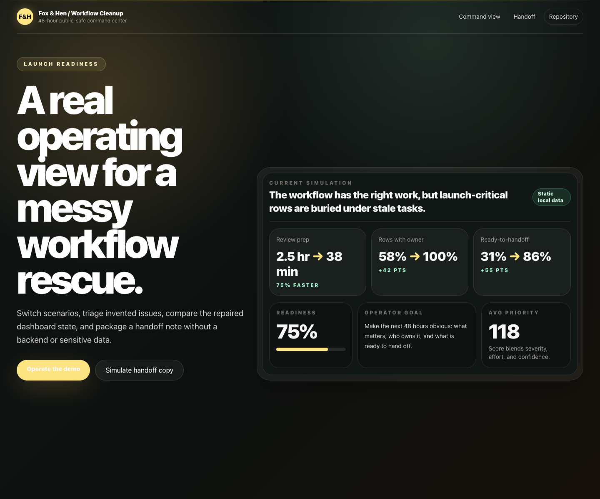

# Workflow Dashboard Cleanup

A public-safe mini product that demonstrates how Fox & Hen can turn a messy workflow or dashboard into a clear 48-hour command center.

The app is intentionally fictional: static TypeScript data, no backend, no auth, no forms, no environment variables, no real names, and no production systems.

## Demo Narrative

This sample models a fixed-scope workflow cleanup engagement. A buyer can switch between three common scenarios, inspect priority-scored issues, compare before/after dashboard language, and review whether the handoff package is ready.

## Key Interactions To Test

- Switch scenarios: `Launch readiness`, `Ops reset`, and `Handoff sprint` each change the metrics, active issues, recommended fix, and export preview.
- Filter the issue queue by status to see stuck, active, watching, and ready workflow items.
- Toggle the issue queue between `Before` and `After` to compare messy-state language with the repaired operating view.
- Select individual issues to inspect severity, effort, confidence, owner role, lane, and service mapping.
- Review the acceptance checklist to see how active issue data drives handoff readiness.
- Click `Simulate handoff copy` to test the temporary copied state without writing to a clipboard or calling an API.

## Service Mapping

- Fox & Hen offer: Fixed 48-hour workflow/dashboard cleanup
- Demo surface: Workflow repair command center
- Live demo: https://foxhen-workflow-dashboard-cleanup.vercel.app
- Repository: https://github.com/foxandhenllc/foxhen-workflow-dashboard-cleanup

| Service moment | Demo artifact | Buyer takeaway |
| --- | --- | --- |
| Diagnose | Scenario switcher, status filters, and priority scores | Shows how messy queues become an ordered repair plan. |
| Repair | Before/after issue language, lane counts, and role load | Makes ownership, status, and next action visible. |
| Handoff | Acceptance checks, handoff proof, and simulated copy state | Demonstrates a reviewable package without using real operations data. |

## Screenshot



## Local Run

```bash
npm install --package-lock=false
npm run dev
```

## Build

```bash
npm run build
```

## Scope Note

This repository uses React, TypeScript, Vite, Tailwind, and local static data only. It does not require accounts, payments, databases, third-party services, credentials, or sensitive operational data.

## Forking Notes

- Replace only `src/data/sample.ts` to adapt the template; keep examples fictional or fully anonymized.
- Update `repo`, `liveUrl`, scenario names, issue titles, and acceptance checks before publishing a fork.
- Do not add real client trackers, screenshots, API keys, analytics, auth, forms, or external workflow integrations.
- Keep the simulated copy action local unless you intentionally add a reviewed clipboard implementation.
